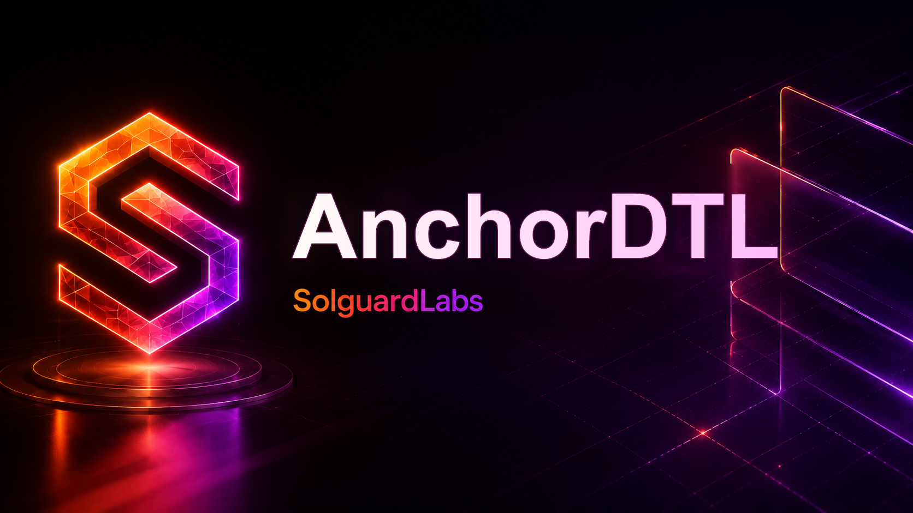

# AnchorDTL



AnchorDTL es una infraestructura Go para fijar garantías económicas entre
operadores y rutas DTL. El motor modela garantías compartidas, obligaciones por
ruta, penalizaciones operativas, reconciliación y reportes de solvencia.

El proyecto está pensado como un sistema local auditable: no requiere servicios
externos, contratos desplegados ni bases de datos. Todo el estado vive en
estructuras Go y puede exportarse como snapshot JSON.

## Componentes

- `src/guarantee.go`: cuentas de garantía, reservas y exposición por ruta.
- `src/obligation.go`: obligaciones económicas, ventanas y estados.
- `src/slashing.go`: cálculo proporcional de penalizaciones.
- `src/reconciliation.go`: reportes de solvencia y cierre de rutas.
- `src/engine.go`: API de alto nivel para operadores, rutas y settlement.
- `src/monitor.go`: alertas operativas sobre utilización y garantías.
- `cmd/anchordtl`: CLI de demo y snapshots.

## Requisitos

- Go 1.22 o superior.
- Bash para ejecutar los scripts de CI local.

## Uso

```bash
go test ./...
go run ./cmd/anchordtl demo
go run ./cmd/anchordtl snapshot
```

## Scripts

```bash
bash scripts/tests.sh
bash scripts/ci.sh
```

`scripts/ci.sh` valida formato, tests y `go vet`.

## Estructura

```text
.
├── cmd/anchordtl
├── src
├── tests
├── scripts
├── .github/workflows
├── .vscode
├── README.md
├── SECURITY.md
└── go.mod
```

## Estado Del Lab

AnchorDTL implementa una superficie de auditoría centrada en accounting de
garantías, rutas y obligaciones. La documentación pública describe el
comportamiento esperado del protocolo y los tests cubren flujos operativos
normales.

